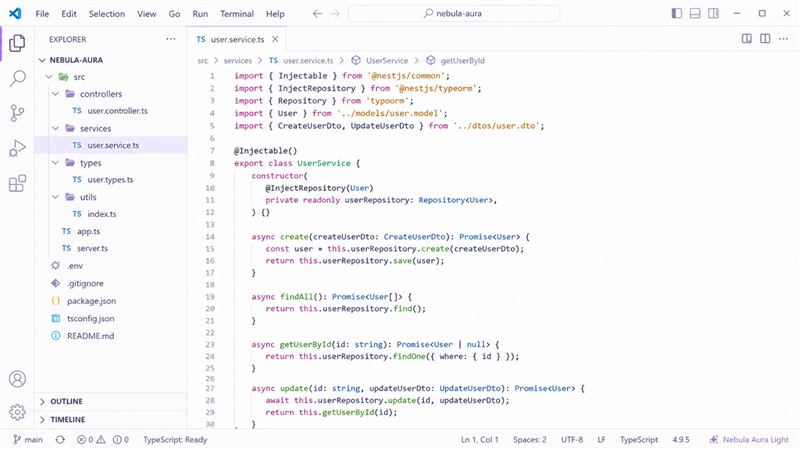
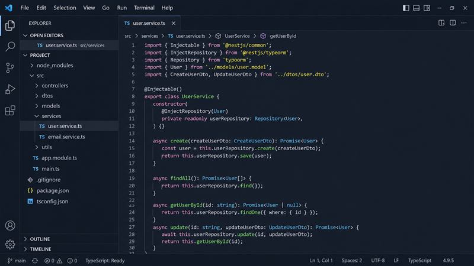
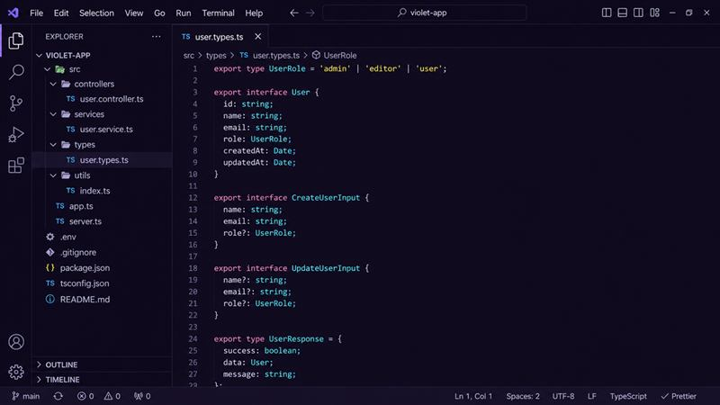
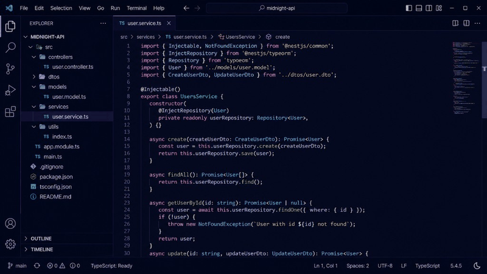

# Nebula Aura Theme

[Visual Studio Marketplace](https://marketplace.visualstudio.com/items?itemName=nebula-themes.nebula-aura-theme) ·
[Open VSX Registry](https://open-vsx.org/extension/nebula-themes/nebula-aura-theme)

[](https://open-vsx.org/extension/nebula-themes/nebula-aura-theme)
[](https://open-vsx.org/extension/nebula-themes/nebula-aura-theme)
[](LICENSE)

A modern light, dark, violet and midnight theme pack for VS Code, Cursor and Antigravity, inspired by Omni.

## Themes

Nebula Aura Theme includes four carefully crafted themes:

| Theme | Type | Style |
| --- | ---: | --- |
| Nebula Aura Light | Light | Clean and soft |
| Nebula Aura Dark | Dark | Balanced and modern |
| Nebula Aura Violet | Dark | Purple-inspired |
| Nebula Aura Midnight | Dark | Deep night coding |

## Recommended For

- VS Code
- Cursor
- Antigravity
- Long coding sessions
- Frontend, backend, cloud and data workflows

## Install

### Visual Studio Marketplace

Install from the [Visual Studio Marketplace](https://marketplace.visualstudio.com/items?itemName=nebula-themes.nebula-aura-theme).

### Open VSX

Install from [Open VSX](https://open-vsx.org/extension/nebula-themes/nebula-aura-theme).

After installing, open the Command Palette (`Ctrl+Shift+P`) → **Preferences: Color Theme** → choose any Nebula Aura theme.

## Compatibility

| Editor | Support |
| --- | --- |
| [Visual Studio Code](https://code.visualstudio.com/) | Full |
| [Cursor](https://cursor.com/) | Full |
| [Antigravity](https://antigravity.dev/) | Full |

## Previews

### Nebula Aura Light



### Nebula Aura Dark



### Nebula Aura Violet



### Nebula Aura Midnight



## Install from VSIX (local)

If you prefer a local install, download the `.vsix` from [GitHub Releases](https://github.com/luismpenholato/nebula-aura-theme/releases).

1. Open your editor.
2. Go to **Extensions** → **...** → **Install from VSIX...**
3. Select the `.vsix` file.

**CLI install:**

```bash
code --install-extension nebula-aura-theme-<version>.vsix
cursor --install-extension nebula-aura-theme-<version>.vsix
antigravity --install-extension nebula-aura-theme-<version>.vsix
```

## Development

1. Open this folder in VS Code or Cursor.
2. Press `F5` to launch the Extension Development Host.
3. **Command Palette** → **Preferences: Color Theme** → select a Nebula Aura theme.

## Contributing

Contributions are welcome. See [CONTRIBUTING.md](CONTRIBUTING.md) for local setup and contribution guidelines.

## Credits

Nebula Aura Theme is based on/inspired by [Omni for Visual Studio Code](https://github.com/getomni/visual-studio-code), originally created by Rocketseat and licensed under the MIT License. This project is not affiliated with Rocketseat or the Omni Theme project.

See [NOTICE](NOTICE) for attribution details.

## Disclaimer

This project is not affiliated with Microsoft, Visual Studio Code, Cursor, Antigravity, Rocketseat or the Omni Theme project.

## License

MIT — see [LICENSE](LICENSE).
